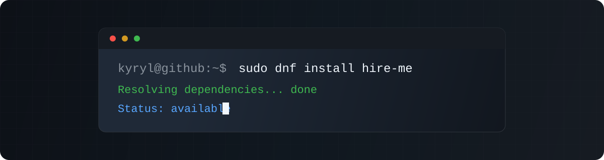

  

  
  
  

  Backend engineer building reliable systems across APIs, cloud infrastructure, data pipelines, integrations, and observability.

---

### Contribution Graph

<picture>
  <source media="(prefers-color-scheme: dark)" srcset="https://raw.githubusercontent.com/rillsvai/rillsvai/output/github-contribution-grid-snake-dark.svg" />
  <source media="(prefers-color-scheme: light)" srcset="https://raw.githubusercontent.com/rillsvai/rillsvai/output/github-contribution-grid-snake.svg" />
  
</picture>

---

  <a href="https://github.com/rillsvai">github.com/rillsvai</a>

